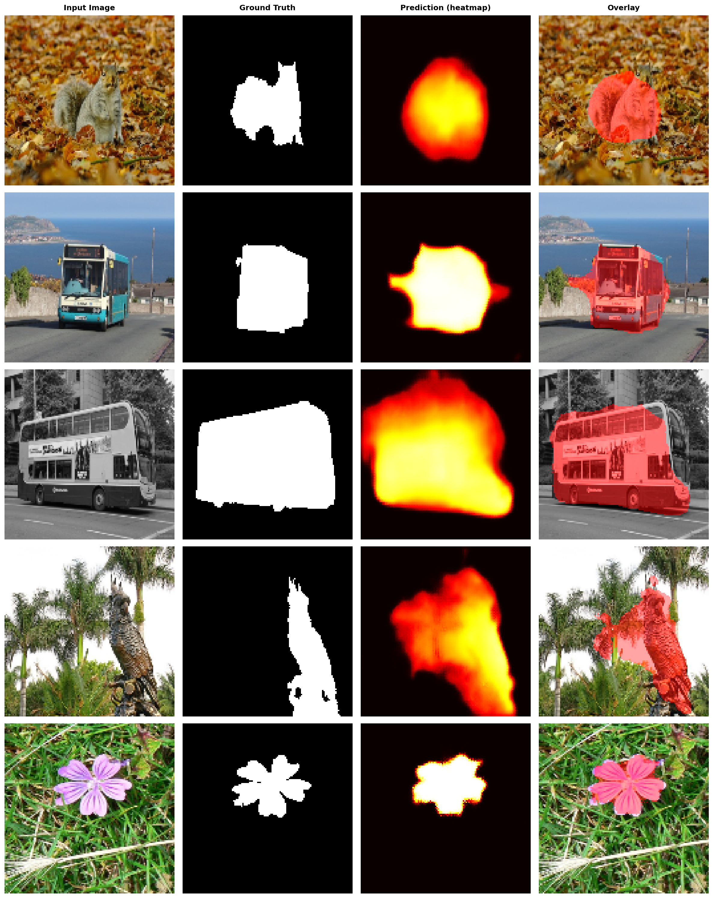

# Salient Object Detection — from Scratch

A complete deep learning pipeline that finds and segments the most visually dominant object in any image. Everything is built from scratch in PyTorch — no pretrained weights, no shortcuts.

---

## What it does

You give it a photo. It gives you back a mask showing exactly which part of the image a human eye would look at first.



---

## Project structure

```
sod/
├── data_loader.py        # Dataset loading, augmentation, train/val/test splits
├── sod_model.py          # Model architectures (Baseline + Improved) and loss function
├── train.py              # Training loop with checkpointing and early stopping
├── evaluate.py           # Metrics (IoU, F1, MAE) and visualisation
├── app.py                # Streamlit demo — upload an image, see the mask
├── demo_notebook.ipynb   # End-to-end Colab notebook
├── requirements.txt      # Python dependencies
└── data/
    └── ECSSD/
        ├── images/               # 1,000 JPEG images
        └── ground_truth_mask/    # 1,000 PNG saliency masks
```

---

## Setup

```bash
pip install -r requirements.txt
```

If you have a CUDA GPU, install the GPU build of PyTorch first:
```bash
pip install torch torchvision --index-url https://download.pytorch.org/whl/cu118
```

The code automatically uses GPU if one is available and falls back to CPU otherwise — no configuration needed.

---

## Dataset

We use **ECSSD** (Extended Complex Scene Saliency Dataset) — 1,000 natural images with pixel-accurate saliency masks.

Download it from [the official CUHK page](https://www.cse.cuhk.edu.hk/leojia/projects/hsaliency/dataset.html) or search for it on Kaggle. Extract it so your folder looks like this:

```
data/ECSSD/
├── images/               ← .jpg files
└── ground_truth_mask/    ← .png files
```

The data loader handles the train/val/test split (70/15/15) automatically.

---

## Training

**Baseline model** (simpler encoder-decoder, no skip connections):
```bash
python train.py --data_dir data/ECSSD --dataset_type ecssd --model_type baseline --epochs 80 --patience 15 --lr 5e-4
```

**Improved model** (ASPP + attention gates + skip connections):
```bash
python train.py --data_dir data/ECSSD --dataset_type ecssd --model_type improved --epochs 80 --patience 15 --lr 5e-4
```

Training saves two checkpoints automatically:
- `checkpoints/baseline_best.pth` — best validation IoU (use this for evaluation)
- `checkpoints/baseline_last.pth` — last epoch (used to resume if training stops)

If training gets interrupted, just re-run the same command — it picks up from where it left off.

---

## Evaluation

Evaluate both models and generate a comparison:
```bash
python evaluate.py \
  --checkpoint checkpoints/baseline_best.pth \
  --data_dir data/ECSSD --dataset_type ecssd \
  --run_name baseline \
  --compare_checkpoint checkpoints/improved_best.pth \
  --compare_name improved \
  --save_dir results
```

This saves prediction grids, training curves, and a comparison bar chart to `results/`.

### Our results

| Metric | Baseline | Improved |
|--------|----------|----------|
| IoU | 0.5890 | **0.6235** |
| Precision | 0.6827 | **0.7269** |
| Recall | 0.8363 | 0.8253 |
| F1 | 0.7176 | **0.7436** |
| MAE | 0.1658 | **0.1501** |

---

## Demo

```bash
streamlit run app.py
```

Opens a browser tab where you can upload any image and instantly see the saliency map and overlay. The prediction threshold is adjustable with a slider.

---

## Models

### Baseline
A plain encoder-decoder. Four convolution + pooling stages compress the image down to 8×8, then four transposed convolution stages bring it back to full size. No skip connections, so fine spatial detail gets lost at the bottleneck. Good enough as a reference point, but the bottleneck is a hard ceiling.

### Improved
Same overall structure but with three key additions:

- **Skip connections** — encoder features are passed directly to the matching decoder stage, so spatial detail doesn't get permanently lost at the bottleneck.
- **ASPP bottleneck** — instead of a single 3×3 conv at 8×8, we run parallel dilated convolutions at rates (1, 2, 4) plus a global average pool. This gives the model context at multiple scales simultaneously.
- **Attention gates** — before merging encoder and decoder features, a small attention network learns to suppress background regions in the skip connection. Only the relevant parts get through.

### Loss function
Three terms, each targeting a different failure mode:

```
L = Focal-BCE  +  1.0 × (1 − IoU)  +  0.5 × (1 − SSIM)
```

- **Focal BCE** — most pixels are background, so plain BCE gets dominated by easy negatives. Focal loss down-weights those and focuses training on hard boundary pixels.
- **IoU loss** — directly optimises the metric we care about. BCE alone doesn't know anything about region overlap.
- **SSIM loss** — keeps the mask structurally sharp and coherent rather than blurry.

---

## Training details

| Setting | Value |
|---------|-------|
| Optimiser | AdamW |
| Learning rate | 5e-4 |
| LR schedule | 3-epoch warmup then cosine decay |
| Gradient clipping | max norm 1.0 |
| Batch size | 16 |
| Max epochs | 80 |
| Early stopping patience | 15 epochs on val IoU |

---

## Augmentations

Applied to training images only, always keeping the image and mask in sync:

| Transform | Probability |
|-----------|-------------|
| Horizontal flip | 50% |
| Vertical flip | 50% |
| Random rotation ±30° | 50% |
| Random crop + resize | 50% |
| Brightness jitter | 50% |
| Contrast jitter | 50% |
| Saturation jitter | 50% |
| Gaussian noise | 60% |
| Random erasing (1–3 patches) | 70% |

---

## Requirements

- Python 3.9+
- PyTorch 2.0+
- OpenCV, NumPy, Matplotlib, scikit-learn, tqdm, Streamlit, Pillow

See `requirements.txt` for exact versions.
